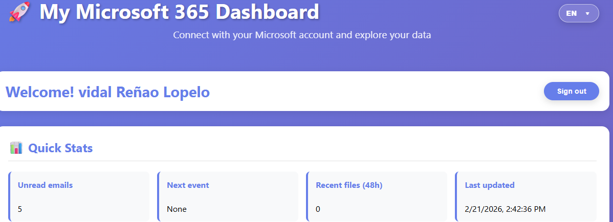

# 🚀 Microsoft 365 Dashboard

> A modern, real-time dashboard connecting to **Microsoft Graph API** — built with vanilla JavaScript and MSAL.js authentication.


---

## 🌍 Available Languages / Idiomas disponibles / Verfügbare Sprachen

| 🇪🇸 [Español](#-español) | 🇬🇧 [English](#-english) | 🇩🇪 [Deutsch](#-deutsch) |
|:---:|:---:|:---:|

---

## 🇪🇸 Español

### 📋 Descripción

Aplicación web moderna que muestra datos de **Microsoft 365** en tiempo real utilizando la **Microsoft Graph API**. Desarrollada con **JavaScript puro** y **MSAL.js** para autenticación segura mediante OAuth 2.0.

### ✨ Funcionalidades

| Función | Descripción |
|---|---|
| 🔐 Autenticación | OAuth 2.0 con MSAL.js |
| 👤 Perfil de usuario | Nombre, email, puesto y ubicación |
| 📊 Quick Stats | Emails no leídos, próximo evento, archivos recientes |
| 📧 Últimos emails | Bandeja de entrada en tiempo real |
| 📅 Calendario | Próximos eventos de los siguientes 7 días |
| 📁 OneDrive | Archivos recientes |
| 🌍 Multi-idioma | Interfaz en ES / EN / DE |
| 🎨 UI moderna | Diseño responsive y accesible |

### 📸 Capturas de pantalla

| Login | Dashboard |
|---|---|
|  |  |

| Perfil | Quick Stats |
|---|---|
|  |  |

| Emails | Calendario |
|---|---|
|  |  |

| Archivos | Cambio de idioma |
|---|---|
|  |  |

### 🚀 Cómo ejecutarlo

```bash
# Clona el repositorio
git clone https://github.com/vidal-renao/m365-graph-dashboard.git
cd m365-graph-dashboard

# Inicia el servidor local
python -m http.server 8080

# Abre en el navegador
http://localhost:8080
```

### ⚙️ Requisitos

- Cuenta de Microsoft 365
- Registro de aplicación en **Azure Active Directory**
- Permisos de Microsoft Graph: `User.Read`, `Mail.Read`, `Calendars.Read`, `Files.Read`

---

## 🇬🇧 English

### 📋 Overview

A modern web application displaying **Microsoft 365** data in real time using the **Microsoft Graph API**. Built with **vanilla JavaScript** and **MSAL.js** for secure OAuth 2.0 authentication.

### ✨ Features

| Feature | Description |
|---|---|
| 🔐 Authentication | OAuth 2.0 with MSAL.js |
| 👤 User profile | Name, email, job title, location |
| 📊 Quick Stats | Unread emails, next event, recent files |
| 📧 Latest emails | Real-time inbox |
| 📅 Calendar | Upcoming events for the next 7 days |
| 📁 OneDrive | Recent files |
| 🌍 Multi-language | UI in ES / EN / DE |
| 🎨 Modern UI | Responsive and accessible design |

### 📸 Screenshots

| Login | Dashboard |
|---|---|
|  |  |

| Profile | Quick Stats |
|---|---|
|  |  |

| Emails | Calendar |
|---|---|
|  |  |

| Files | Language switch |
|---|---|
|  |  |

### 🚀 How to run

```bash
# Clone the repository
git clone https://github.com/vidal-renao/m365-graph-dashboard.git
cd m365-graph-dashboard

# Start local server
python -m http.server 8080

# Open in browser
http://localhost:8080
```

### ⚙️ Requirements

- Microsoft 365 account
- App registration in **Azure Active Directory**
- Microsoft Graph permissions: `User.Read`, `Mail.Read`, `Calendars.Read`, `Files.Read`

---

## 🇩🇪 Deutsch

### 📋 Übersicht

Eine moderne Webanwendung, die **Microsoft 365**-Daten in Echtzeit über die **Microsoft Graph API** anzeigt. Entwickelt mit **Vanilla JavaScript** und **MSAL.js** für sichere OAuth 2.0-Authentifizierung.

### ✨ Funktionen

| Funktion | Beschreibung |
|---|---|
| 🔐 Authentifizierung | OAuth 2.0 mit MSAL.js |
| 👤 Benutzerprofil | Name, E-Mail, Stelle, Standort |
| 📊 Quick Stats | Ungelesene E-Mails, nächster Termin, aktuelle Dateien |
| 📧 Letzte E-Mails | Posteingang in Echtzeit |
| 📅 Kalender | Nächste Termine der folgenden 7 Tage |
| 📁 OneDrive | Zuletzt verwendete Dateien |
| 🌍 Mehrsprachig | Oberfläche in ES / EN / DE |
| 🎨 Modernes UI | Responsives und barrierefreies Design |

### 📸 Screenshots

| Login | Dashboard |
|---|---|
|  |  |

| Profil | Quick Stats |
|---|---|
|  |  |

| E-Mails | Kalender |
|---|---|
|  |  |

| Dateien | Sprachwechsel |
|---|---|
|  |  |

### 🚀 Lokal starten

```bash
# Repository klonen
git clone https://github.com/vidal-renao/m365-graph-dashboard.git
cd m365-graph-dashboard

# Lokalen Server starten
python -m http.server 8080

# Im Browser öffnen
http://localhost:8080
```

### ⚙️ Voraussetzungen

- Microsoft 365-Konto
- App-Registrierung in **Azure Active Directory**
- Microsoft Graph-Berechtigungen: `User.Read`, `Mail.Read`, `Calendars.Read`, `Files.Read`

---

## 🛠️ Tech Stack


---

## 👤 Author

**Vidal Reñao Lopelo**

[](https://github.com/vidal-renao)

---

⭐ Si te gusta este proyecto, ¡dale una estrella! / If you like this project, give it a star! / Wenn Ihnen dieses Projekt gefällt, geben Sie ihm einen Stern!
