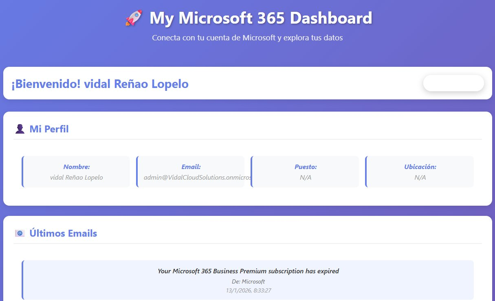
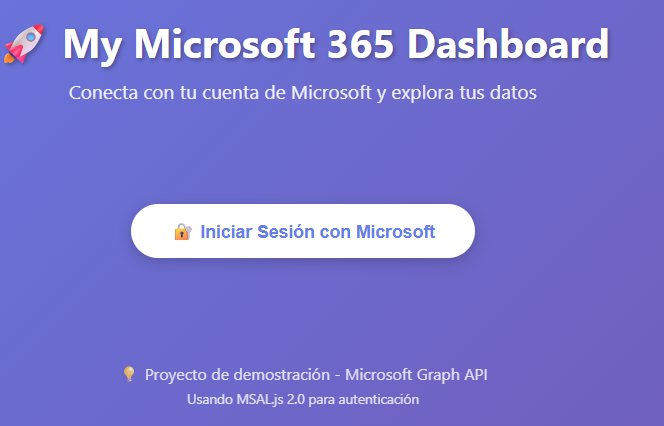
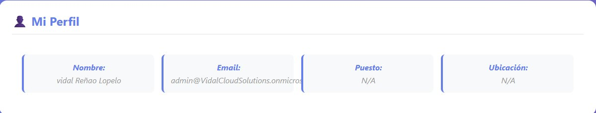
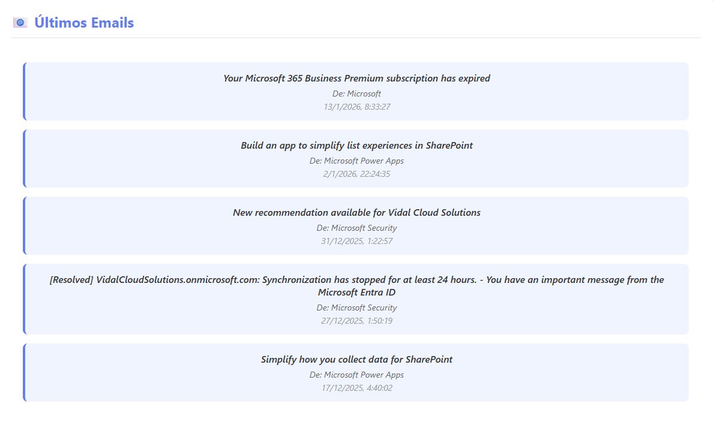
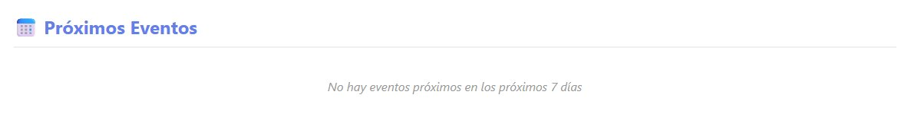
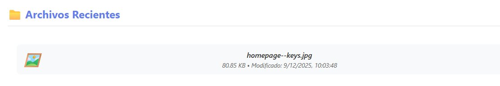

# 🚀 Microsoft 365 Dashboard

A modern, real-time dashboard application that displays Microsoft 365 data using Microsoft Graph API. Built with vanilla JavaScript and MSAL.js for authentication.



## 📋 Overview

This application demonstrates seamless integration with Microsoft 365 services through the Microsoft Graph API. It provides a unified view of user data including profile information, emails, calendar events, and OneDrive files - all in a clean, responsive interface.

## ✨ Features

- 🔐 **Secure Authentication** - OAuth 2.0 authentication using MSAL.js
- 👤 **User Profile** - Display user information (name, email, job title, location)
- 📧 **Email Integration** - View your 5 most recent emails with read/unread status
- 📅 **Calendar Events** - Display upcoming events for the next 7 days
- 📁 **OneDrive Files** - List recently modified files with metadata
- 🎨 **Modern UI** - Clean, responsive design with gradient backgrounds
- ⚡ **Real-time Data** - Direct API calls to Microsoft 365 services

## 🛠️ Technologies Used

- **Frontend**: HTML5, CSS3, JavaScript (ES6+)
- **Authentication**: MSAL.js 2.38.1 (Microsoft Authentication Library)
- **API**: Microsoft Graph API v1.0
- **Server**: Python HTTP Server (for local development)

## 📸 Screenshots

### Login Screen


### User Profile Section


### Email View


### Calendar Events


### OneDrive Files


## 🔑 API Permissions

The application requests the following Microsoft Graph API permissions:

| Permission | Type | Description |
|------------|------|-------------|
| `User.Read` | Delegated | Read user profile information |
| `Mail.Read` | Delegated | Read user's emails |
| `Calendars.Read` | Delegated | Read user's calendar events |
| `Files.Read.All` | Delegated | Read all files user can access |

## 🚀 Getting Started

### Prerequisites

- Python 3.x installed on your system
- A Microsoft account (personal or work/school)
- Azure AD application registration

### Azure AD Setup

1. Go to [Azure Portal](https://portal.azure.com)
2. Navigate to **Azure Active Directory** > **App registrations**
3. Click **New registration**
4. Configure:
   - **Name**: My365Dashboard
   - **Supported account types**: Accounts in any organizational directory and personal Microsoft accounts
   - **Redirect URI**: Single-page application (SPA) - `http://localhost:8080`
5. Note your **Application (client) ID**
6. Go to **API permissions** and add:
   - Microsoft Graph > Delegated permissions
   - Add: `User.Read`, `Mail.Read`, `Calendars.Read`, `Files.Read.All`
7. Grant admin consent (if required)

### Installation & Running

1. **Clone the repository**
   ```bash
   git clone https://github.com/vidal-renao/m365-graph-dashboard.git
   cd m365-graph-dashboard
   ```

2. **Update the Application ID**
   
   Open `app.js` and replace the `clientId` with your Application ID:
   ```javascript
   const msalConfig = {
       auth: {
           clientId: 'YOUR-APPLICATION-ID-HERE',
           // ...
       }
   };
   ```

3. **Start the local server**
   
   **On Windows:**
   ```bash
   # Double-click start.bat
   # OR run in PowerShell:
   python -m http.server 8080
   ```
   
   **On Mac/Linux:**
   ```bash
   # Make script executable (first time only)
   chmod +x start.sh
   
   # Run the script
   ./start.sh
   
   # OR run directly:
   python3 -m http.server 8080
   ```

4. **Open in browser**
   
   Navigate to: `http://localhost:8080`

5. **Login and explore**
   
   Click "Iniciar Sesión con Microsoft" and authenticate with your Microsoft account

## 📂 Project Structure

```
m365-graph-dashboard/
├── index.html          # Main HTML file
├── app.js              # Application logic and API calls
├── styles.css          # Styling and responsive design
├── README.md           # This file
├── start.sh            # Launch script for Mac/Linux
└── start.bat           # Launch script for Windows
```

## 🔧 How It Works

### Authentication Flow

1. User clicks "Login" button
2. MSAL.js initiates OAuth 2.0 popup flow
3. User authenticates with Microsoft
4. Application receives access token
5. Token is used for subsequent Graph API calls

### API Integration

```javascript
// Example: Fetching user profile
const response = await fetch('https://graph.microsoft.com/v1.0/me', {
    headers: {
        'Authorization': `Bearer ${accessToken}`
    }
});
const profile = await response.json();
```

## 🎯 Key Features Explained

### Profile Section
Displays user information retrieved from the `/me` endpoint, including:
- Display name
- Email address
- Job title
- Office location

### Email Section
Fetches the 5 most recent messages using the `/me/messages` endpoint with filtering for:
- Subject
- Sender information
- Received date/time
- Read/unread status

### Calendar Section
Retrieves upcoming events for the next 7 days using `/me/calendarView` with:
- Event subject
- Start and end times
- Location (if specified)

### Files Section
Lists recently accessed files from OneDrive using `/me/drive/recent` showing:
- File name
- File size (formatted)
- Last modified date
- File type icon

## 🔒 Security & Privacy

- ✅ Uses industry-standard OAuth 2.0 authentication
- ✅ Tokens are stored securely in browser's localStorage
- ✅ No credentials are stored in the application
- ✅ Only requests necessary permissions (principle of least privilege)
- ✅ All API calls are made over HTTPS

## 🐛 Troubleshooting

### "Redirect URI mismatch" error
- Ensure you're accessing the app at exactly `http://localhost:8080`
- Verify the redirect URI in Azure AD matches exactly

### CORS errors
- Make sure you're running a local web server (not opening files directly)
- Use the correct port (8080)

### No emails/calendar/files showing
- Verify you have these services configured in your Microsoft account
- Some features may require a work/school account (Microsoft 365 subscription)
- Check browser console for specific API errors

### Authentication popup blocked
- Allow popups for localhost in your browser settings

## 📚 Learning Resources

- [Microsoft Graph API Documentation](https://docs.microsoft.com/graph/)
- [MSAL.js Documentation](https://github.com/AzureAD/microsoft-authentication-library-for-js)
- [Microsoft Graph Explorer](https://developer.microsoft.com/graph/graph-explorer)

## 🎓 Purpose

This project was created to demonstrate:
- Integration with Microsoft Graph API
- Modern authentication patterns with MSAL.js
- Single-page application (SPA) architecture
- Real-world API consumption
- OAuth 2.0 implementation

Built as part of the **Microsoft 365 Developer Program** to showcase practical Graph API integration.

## 📝 License

This project is open source and available for educational purposes.

## 👤 Author

**Vidal Reñao**
- GitHub: [@vidal-renao](https://github.com/vidal-renao)
- Project: [m365-graph-dashboard](https://github.com/vidal-renao/m365-graph-dashboard)

## 🤝 Contributing

Contributions, issues, and feature requests are welcome! Feel free to check the issues page.

## ⭐ Show Your Support

If this project helped you learn about Microsoft Graph API integration, please give it a star! ⭐

---

**Built with ❤️ using Microsoft Graph API**
