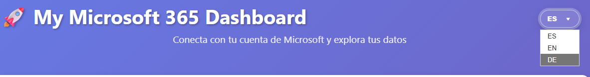

# 🚀 Microsoft 365 Dashboard


---

## 🇪🇸 Español

### 📋 Descripción
Aplicación moderna y en tiempo real que muestra datos de **Microsoft 365** utilizando **Microsoft Graph API**.  
Desarrollada con **JavaScript puro** y **MSAL.js** para autenticación segura.

### ✨ Funcionalidades
- 🔐 Autenticación OAuth 2.0 con MSAL.js  
- 👤 Perfil de usuario (nombre, email, puesto, ubicación)  
- 📧 Últimos correos electrónicos  
- 📅 Próximos eventos del calendario (7 días)  
- 📁 Archivos recientes de OneDrive  
- 🌍 Interfaz multi‑idioma (ES / EN / DE)  
- 🎨 UI moderna y responsive  

### 📸 Capturas




### 🚀 Uso
```bash
python -m http.server 8080
```
Abrir: http://localhost:8080

---

## 🇬🇧 English

### 📋 Overview
A modern real‑time dashboard that displays **Microsoft 365** data using the **Microsoft Graph API**.  
Built with **vanilla JavaScript** and **MSAL.js** for secure authentication.

### ✨ Features
- 🔐 OAuth 2.0 authentication with MSAL.js  
- 👤 User profile information  
- 📧 Latest emails  
- 📅 Upcoming calendar events (next 7 days)  
- 📁 Recent OneDrive files  
- 🌍 Multi‑language UI (ES / EN / DE)  
- 🎨 Modern and responsive interface  

### 📸 Screenshots


### 🚀 Run locally
```bash
python -m http.server 8080
```
Open: http://localhost:8080

---

## 🇩🇪 Deutsch

### 📋 Übersicht
Moderne Echtzeit‑Dashboard‑Anwendung zur Anzeige von **Microsoft 365‑Daten** über die **Microsoft Graph API**.  
Entwickelt mit **Vanilla JavaScript** und **MSAL.js** für sichere Authentifizierung.

### ✨ Funktionen
- 🔐 OAuth 2.0‑Authentifizierung mit MSAL.js  
- 👤 Benutzerprofil‑Informationen  
- 📧 Letzte E‑Mails  
- 📅 Nächste Kalendertermine (7 Tage)  
- 📁 Kürzlich verwendete OneDrive‑Dateien  
- 🌍 Mehrsprachige Oberfläche (ES / EN / DE)  
- 🎨 Modernes, responsives Design  

### 📸 Screenshots


### 🚀 Lokal starten
```bash
python -m http.server 8080
```
Öffnen: http://localhost:8080

---

## 👤 Author
**Vidal Reñao Lopelo**  
GitHub: https://github.com/vidal-renao  

⭐ If you like this project, give it a star!
